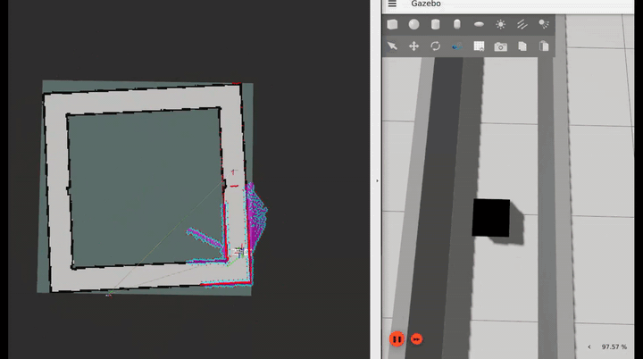
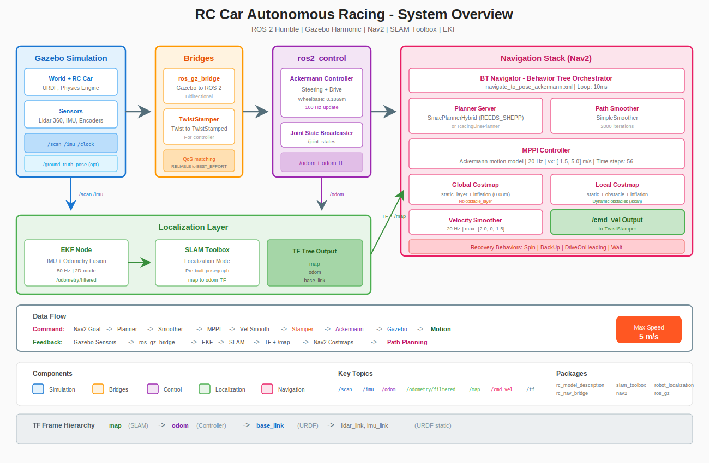

# NCHSB — High-Speed Narrow-Corridor Autonomous Racing

[](LICENSE)
[](https://docs.ros.org/en/humble/)
[](https://gazebosim.org/)
[](https://github.com/Nishant-ZFYII/NCHSB)

> High-speed autonomous racing through narrow indoor corridors at up to **~10 m/s** with **~20–30 cm wall clearance**. ROS 2 Humble + Nav2 MPPI + Gazebo Sim, with an **emergency-MPC fallback** when collision becomes inevitable, and an explicit **Human > Object > Wall** ethical cost hierarchy. Sim-to-real targeting **Traxxas Maxx 4S + Jetson Orin Nano**.

<p align="center">
  
  <br/><em>Standard narrow-corridor run.</em>
</p>

<p align="center">
  
  
  <br/><em>Tight-space variants: a solid cube is placed mid-corridor; the bot threads the residual gap between the cube and the wall.</em>
</p>

---

## Goals

1. Detect and track static and dynamic obstacles from a single LiDAR.
2. Prioritize human safety with an ethical cost hierarchy (Human > Object > Wall).
3. Plan time-optimal trajectories in tight corridors at up to **~10 m/s**.
4. Fall back to **emergency MPC** when a collision becomes inevitable, minimizing impact severity.
5. Hold an end-to-end planning loop **under 80 ms**.

See [`PROJECT_DESCRIPTION.txt`](PROJECT_DESCRIPTION.txt) for the full research framing and reference papers.

---

## Tech Stack

| Layer | Component |
|---|---|
| OS | Ubuntu 22.04 |
| Middleware | ROS 2 Humble |
| Simulator | Gazebo Sim (Ignition Fortress / Harmonic) via `ros_gz` |
| Localization | `robot_localization` EKF (IMU + wheel odometry) |
| Mapping / Loc. | SLAM Toolbox |
| Navigation | Nav2 with MPPI controller |
| Control | `ros2_control` + `ackermann_steering_controller` |
| Hardware target | Traxxas Maxx 4S · Jetson Orin Nano 8 GB · RPLiDAR A2M8 · Orbbec Femto Bolt · VESC 6 MkVI · Teensy 4.1 |

---

## Repository Layout

```
NCHSB/
├── src/
│   ├── rc_model_description/   # URDF/xacro, Gazebo plugins, launch files
│   ├── rc_nav_bridge/          # /cmd_vel → ackermann_steering_controller bridge
│   └── rc_racing_planner/      # racing-line + planner experiments
├── rc_hardware_bringup/        # real-hardware bringup (Traxxas + Jetson)
├── aws-robomaker-hospital-world/ # corridor / hospital sim worlds
├── racing_line_tools/          # racing-line generation & optimization scripts
├── docs/                       # architecture notes, install guide, media
│   └── media/                  # README GIFs
├── presentations/              # slides + ROS graph diagrams
├── results/                    # recorded run logs
├── launch_all.sh               # bring up the whole sim stack
├── launch_multi_terminal.sh    # split bring-up across terminals (debugging)
├── INSTALL_APT_PACKAGES.txt    # apt install list
└── RUN_COMMANDS.txt            # step-by-step launch reference
```

---

## Install

Tested on **Ubuntu 22.04** with **ROS 2 Humble**. Full apt list lives in [`INSTALL_APT_PACKAGES.txt`](INSTALL_APT_PACKAGES.txt); the essentials:

```bash
sudo apt update
sudo apt install -y \
  ros-humble-desktop \
  ros-humble-ros-gz-sim ros-humble-ros-gz-bridge \
  ros-humble-ros-gz-image ros-humble-ros-gz-interfaces \
  ros-humble-ros2-control ros-humble-ros2-controllers ros-humble-gz-ros2-control \
  ros-humble-ackermann-msgs ros-humble-ackermann-steering-controller \
  ros-humble-robot-localization ros-humble-slam-toolbox \
  ros-humble-navigation2 ros-humble-nav2-bringup \
  ros-humble-teleop-twist-keyboard ros-humble-rviz2 \
  python3-colcon-common-extensions python3-rosdep
```

Build the workspace:

```bash
colcon build --symlink-install
source install/setup.bash
```

---

## Quick Start — Simulation

The fast path uses the convenience launcher:

```bash
./launch_all.sh
```

Or bring it up manually, one component per terminal (see [`RUN_COMMANDS.txt`](RUN_COMMANDS.txt)):

```bash
source /opt/ros/humble/setup.bash
source install/setup.bash

# 1. Gazebo + robot + Ackermann controller
ros2 launch rc_model_description fortress_bringup.launch.py

# 2. EKF: fuse IMU + wheel odom → /odometry/filtered
ros2 launch rc_model_description ekf_imu_odom.launch.py use_sim_time:=true

# 3. SLAM Toolbox (localization mode)
ros2 launch rc_model_description slam_localization.launch.py use_sim_time:=true

# 4. Nav2 stack
ros2 launch rc_model_description nav2_rc_bringup.launch.py use_sim_time:=true

# 5. /cmd_vel bridge + keyboard teleop
ros2 run rc_nav_bridge stamper --ros-args \
    -p frame_id:=base_link \
    -r cmd_vel:=/cmd_vel \
    -r reference:=/ackermann_steering_controller/reference
ros2 run teleop_twist_keyboard teleop_twist_keyboard --ros-args -r cmd_vel:=/cmd_vel
```

Send goals via RViz's **2D Goal Pose** button, or drive manually with the teleop keys.

---

## Hardware Bringup (Traxxas Maxx 4S)

Real-hardware deployment lives in [`rc_hardware_bringup/`](rc_hardware_bringup/). It mirrors the simulation ROS graph but swaps Gazebo plugins for real drivers — RPLiDAR A2M8, Orbbec Femto Bolt depth + RGB + IMU, and a Teensy 4.1 serial bridge to a VESC 6 MkVI motor controller. See [`rc_hardware_bringup/README.md`](rc_hardware_bringup/README.md) for wiring, udev rules, the Teensy serial protocol, and the three-step bringup (teleop → SLAM mapping → autonomous nav).

---

## Architecture

<p align="center">
  
  <br/><em>End-to-end pipeline: Gazebo → ros_gz bridges → EKF + SLAM → Nav2 (MPPI) → ackermann_steering_controller.</em>
</p>

Minimal data-flow:

```
LiDAR ──→ /scan ──→ SLAM Toolbox ──→ map→odom TF ──┐
                                                     ├──→ Nav2 (MPPI) ──→ /cmd_vel ──→ stamper ──→ ackermann_steering_controller
IMU + wheel odom ──→ EKF ──→ odom→base_link TF ────┘
```

### Detailed graphs

- **Cleaned ROS 2 node graph** — [`docs/images/ros_graph_simplified.svg`](docs/images/ros_graph_simplified.svg) (hand-drawn, easier to read than the live rqt export).
- **Live `rqt_graph` capture** — [`docs/images/rqt_graph_full.png`](docs/images/rqt_graph_full.png) (every node and topic from a running stack; high-res, click to zoom).
- **TF tree** — [`frames_2025-11-29_17.05.57.pdf`](frames_2025-11-29_17.05.57.pdf), with Graphviz source [`frames_2025-11-29_17.05.57.gv`](frames_2025-11-29_17.05.57.gv).

<p align="center">
  <a href="docs/images/rqt_graph_full.png">
    
  </a>
  <br/><em>Live <code>rqt_graph</code> snapshot — click to open the full 10081×6433 image.</em>
</p>

See also [`docs/ARCHITECTURE.md`](docs/ARCHITECTURE.md) for narrative documentation.

---

## Author

Nishant Pushparaju · nishantpushparaju@gmail.com · [github.com/Nishant-ZFYII](https://github.com/Nishant-ZFYII)

---

## License

See [`LICENSE`](LICENSE).
